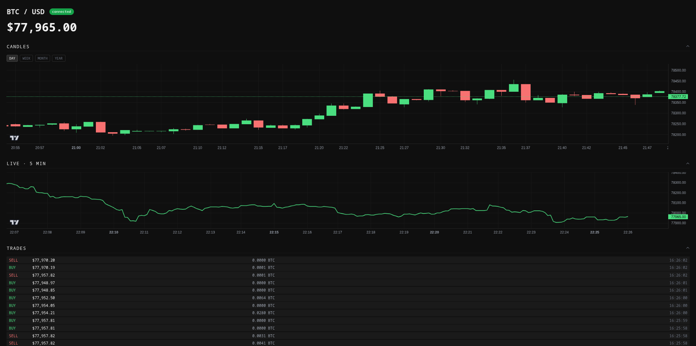

# fastify-react-btc-dashboard

[](https://github.com/zzzzzzz-web/fastify-react-btc-dashboard/actions/workflows/ci.yml)

A real-time BTC/USD price and trade dashboard built with Fastify, WebSockets, React, Redis, and TimescaleDB.



## Features

- Live BTC/USD price streamed from the Coinbase WebSocket feed
- Candlestick chart with day / week / month / year range selector, powered by TimescaleDB continuous aggregates
- Live 5-minute price line chart backed by Redis
- Real-time trade feed (last 500 trades)
- All sections collapsible; hold Shift + scroll to interact with charts

## Stack

| Layer | Technology |
|---|---|
| Backend | Fastify, `@fastify/websocket` |
| Data source | Coinbase Advanced Trade WebSocket |
| Cache / backfill | Redis |
| Time-series storage | TimescaleDB (PostgreSQL) |
| Frontend | React, Vite, lightweight-charts v5 |
| Reverse proxy | nginx |

## Development

```bash
cp .env.example .env
docker compose up -d        # redis + postgres
pnpm install
pnpm dev                    # server on :3000, client on :5173
```

## Commands

```bash
pnpm test          # run all tests (vitest)
pnpm lint          # eslint
pnpm format        # prettier

# typecheck
pnpm --filter @btc-dashboard/server exec tsc --noEmit
pnpm --filter @btc-dashboard/client exec tsc --noEmit
```

## CI

Every push to `main` runs typecheck → lint → tests via GitHub Actions. If all pass, Docker images are built and pushed to GitHub Container Registry:

```
ghcr.io/zzzzzzz-web/fastify-react-btc-dashboard/server:latest
ghcr.io/zzzzzzz-web/fastify-react-btc-dashboard/nginx:latest
```

Images are also tagged with the commit SHA for rollback. To skip CI for a commit (e.g. docs changes), add `[skip ci]` to the commit message.

## Production

```bash
cp .env.example .env.production
# edit .env.production with real credentials

docker compose -f docker-compose.prod.yml up --build
```

App is served on port 80. nginx handles static files and proxies `/candles` and `/stream` to the server.

## Project structure

```
├── packages/
│   ├── client/        # React + Vite
│   └── server/        # Fastify + WebSocket
├── infra/
│   ├── nginx/         # nginx config + Dockerfile (multi-stage client build)
│   └── postgres/      # TimescaleDB init SQL
├── docker-compose.yml
└── docker-compose.prod.yml
```
